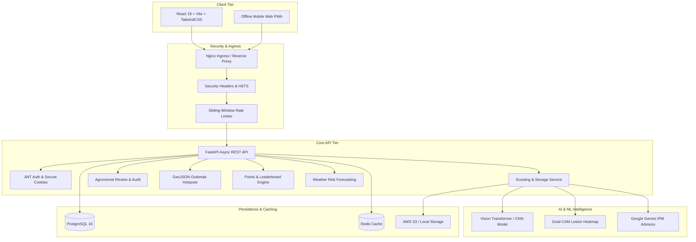

# 🌿 CropHealthAI (`god_thinks`)

[](https://github.com/vu241fa04a65-alt/god_thinks/actions)
[](https://www.docker.com/)
[](https://fastapi.tiangolo.com/)
[](https://react.dev/)
[](https://www.typescriptlang.org/)
[](https://www.python.org/)
[-success.svg)](./docs/security.md)
[](LICENSE)

**CropHealthAI** is a production-grade, edge-ready precision agriculture platform engineered to empower smallholder farmers, researchers, and agronomists. It bridges computer vision disease diagnostics, Grad-CAM explainability, multilingual Integrated Pest Management (IPM) advisories, community outbreak surveillance, and expert validation in a gamified, mobile-friendly interface.

---

## 🌟 Key Highlights & Capabilities

- 🔍 **Real-Time Visual Disease Diagnosis**: Convolutional neural network classification covering 38+ crop species and pathogen conditions (Tomato, Potato, Corn, Apple, Rice, Wheat).
- 🧠 **Explainable AI (Grad-CAM)**: Heatmap visualization overlays demonstrating exact infected foliage lesions, building trust with field scouts.
- 🌐 **Multilingual IPM Treatment Engine**: Dynamic translation into vernacular languages (Hindi, Telugu, Tamil, Marathi, Spanish) prioritizing biological controls and warning against regional chemical bans and Pre-Harvest Interval (PHI) risks.
- 🧑‍🌾 **Expert-in-the-Loop Validation**: Certified agronomist review portal with side-by-side zoom, approve/reject triage, and immutable audit logs.
- 🗺️ **Community Biosecurity & GeoJSON Outbreaks**: Dynamic clustering of disease sightings on interactive maps with geo-fenced SMS broadcast alerts.
- 🏆 **Gamified Farmer Engagement**: Points ledger, milestone achievement badges, regional leaderboards, and agricultural voucher redemptions.
- ⛅ **Hyper-Local Weather Disease Risk**: 3-day predictive humidity and temperature risk indices for preventive crop protection.
- 📶 **Offline-First Field Scouting**: Local IndexedDB caching and batch synchronization for remote rural areas with intermittent connectivity.
- 🛡️ **Hardened Enterprise Security**: HTTPS redirection, HSTS headers, `HttpOnly` refresh token cookies, executable magic byte & malware payload scanning, sliding-window rate limiting, and CORS whitelisting.
- 📊 **Full-Stack Observability**: Built-in Prometheus `/metrics`, Sentry error tracing, rotating structured JSON logging, and Kubernetes `/health` & `/ready` probes.

---

## 🏛️ System Architecture



For comprehensive component breakdowns and sequential data flows, consult [docs/architecture.md](./docs/architecture.md).

---

## 📂 Repository Layout

```text
god_thinks/
├── backend/                    # FastAPI Backend Application
│   ├── app/
│   │   ├── auth/              # JWT tokens, rate limiting & security middleware
│   │   ├── controllers/       # High-level business orchestrators
│   │   ├── models/            # SQLAlchemy database entities
│   │   ├── routes/            # REST API endpoint routers
│   │   ├── schemas/           # Pydantic data schemas & validation
│   │   ├── services/          # External integrations (Twilio, Weather, Gemini)
│   │   └── utils/             # Sanitizer, logger, metrics, storage
│   ├── tests/                 # Comprehensive pytest test suite
│   ├── Dockerfile             # Multi-stage Python backend Docker image
│   └── requirements.txt       # Python backend dependencies
├── frontend/                   # React + TypeScript + Vite Frontend
│   ├── src/
│   │   ├── components/        # UI components (PointsCard, Badges, AdvisoryCard)
│   │   ├── pages/             # Pages (Dashboard, Leaderboard, ExpertPortal, Settings)
│   │   ├── services/          # API client services (reports, auth, alerts)
│   │   └── tests/             # Jest & React Testing Library tests
│   ├── Dockerfile             # Multi-stage Node build & Nginx serving image
│   └── package.json           # Frontend dependencies & scripts
├── docs/                       # Technical documentation
│   ├── architecture.md        # System architecture & sequence diagrams
│   ├── api_spec.md            # Exhaustive REST API specification & curl samples
│   ├── demo_script.md         # 8-minute hackathon demo script & test flows
│   ├── security.md            # Security hardening guide & production checklist
│   └── observability.md       # Sentry & Prometheus monitoring guide
├── k8s/                        # Production Kubernetes manifests
├── scripts/                    # Deploy, dev startup, and terraform stubs
├── docker-compose.yml          # Multi-container orchestration (DB, API, Web, Redis)
└── README.md                   # Project landing page & quick start
```

---

## 🚀 Quick Start Guide

### Option 1: Docker Compose (Recommended)

Run the entire platform (Postgres, Redis, FastAPI Backend, React Frontend, pgAdmin) with a single command:

```bash
# Clone the repository
git clone https://github.com/vu241fa04a65-alt/god_thinks.git
cd god_thinks

# Launch all microservices
docker-compose up --build
```

- **Frontend Web UI**: `http://localhost:3000`
- **Backend API & Swagger UI**: `http://localhost:8000/docs`
- **Prometheus Metrics**: `http://localhost:8000/metrics`
- **pgAdmin Database Explorer**: `http://localhost:5050` (admin@crophealth.ai / admin)

---

### Option 2: Local Development Setup

#### 1. Backend Setup (FastAPI & Python 3.11+)
```bash
cd backend

# Create and activate virtual environment
python -m venv venv
# On Windows:
.\venv\Scripts\activate
# On Linux/macOS:
source venv/bin/activate

# Install dependencies
pip install -r requirements.txt

# Configure environment variables
cp .env.example .env

# Run FastAPI server with auto-reload
python -m uvicorn backend.app.main:app --host 0.0.0.0 --port 8000 --reload
```

#### 2. Frontend Setup (React 18, Vite & TailwindCSS)
```bash
cd frontend

# Install Node dependencies
npm install

# Configure environment variables
cp .env.example .env

# Launch Vite development server
npm run dev
```

Visit `http://localhost:5173` to explore the application.

---

## 🧪 Running Automated Tests

CropHealthAI maintains high automated test coverage across backend microservices and frontend user interfaces:

### Backend Pytest Suite
```bash
cd god_thinks

# Run all backend unit and integration tests
python -m pytest backend/tests/test_auth.py backend/tests/test_reports.py backend/tests/test_observability.py backend/tests/test_auth_security.py -v
```

### Frontend Jest Suite
```bash
cd frontend

# Run Jest unit and component tests
npm test -- --watchAll=false
```

---

## 🚢 Production Deployment

### Kubernetes Deployment (`k8s/`)
Production-ready Kubernetes configurations are located in `/k8s`:
```bash
# 1. Apply ConfigMap and Secret templates
kubectl apply -f k8s/backend-configmap.yaml
kubectl apply -f k8s/secret-template.yaml

# 2. Deploy PostgreSQL and Redis services
kubectl apply -f k8s/postgres-deployment.yaml

# 3. Deploy CropHealthAI Backend & Ingress
kubectl apply -f k8s/backend-deployment.yaml
kubectl apply -f k8s/backend-service.yaml
kubectl apply -f k8s/ingress.yaml
```

### One-Click Deploy Script
A convenience deployment script is provided in `/scripts/deploy.sh` for automated container builds, tagging, and registry pushes:
```bash
chmod +x scripts/deploy.sh
./scripts/deploy.sh --env production
```

---

## ⚙️ Environment Variables Reference

| Variable | Default Value | Description |
| :--- | :--- | :--- |
| `ENVIRONMENT` | `development` | Deployment mode (`development`, `staging`, `production`) |
| `SECRET_KEY` | *(Set securely)* | 32+ character key for JWT token signing |
| `DATABASE_URL` | `postgresql://...` | PostgreSQL connection string |
| `REDIS_URL` | `redis://localhost:6379/0` | Redis caching connection string |
| `CORS_ORIGINS` | `http://localhost:3000,...` | Comma-separated allowed frontend origins |
| `ENFORCE_HTTPS` | `false` | When `true`, enforces HTTPS 301 redirects and HSTS |
| `RATE_LIMIT_PER_MINUTE` | `120` | Sliding window rate limit per client IP |
| `MAX_IMAGE_SIZE_MB` | `10` | Maximum upload size for foliage imagery |
| `S3_BUCKET_NAME` | `""` | AWS S3 bucket for cloud asset storage |
| `SENTRY_DSN` | `""` | Sentry error tracking project DSN |
| `TWILIO_ACCOUNT_SID` | `""` | Twilio SID for outbreak broadcast SMS alerts |
| `GEMINI_API_KEY` | `""` | Google Gemini API key for multilingual advisories |

---

## 📖 In-Depth Documentation Links

- 🏛️ [System Architecture & Data Flows](./docs/architecture.md)
- 📡 [Complete REST API Specification with cURL Samples](./docs/api_spec.md)
- 🎬 [Step-by-Step Hackathon Demo Script](./docs/demo_script.md)
- 🛡️ [Security Hardening & Threat Mitigation Guide](./docs/security.md)
- 📈 [Observability, Sentry & Prometheus Guide](./docs/observability.md)

---

## 🤝 Contribution Guidelines

1. **Fork the Repository** and clone your fork locally.
2. **Create a Feature Branch**: `git checkout -b feature/amazing-feature`.
3. **Write Unit Tests**: Ensure new endpoints have corresponding pytest/jest tests.
4. **Adhere to Code Quality**: Run `flake8` on backend and `npm run lint` on frontend.
5. **Commit Your Changes**: Follow conventional commits (e.g. `feat(advisory): add organic neem oil rule`).
6. **Open a Pull Request**: Provide a clear description and screenshot attachments where applicable.

---

## 📄 License & Acknowledgments

This project is licensed under the **MIT License** - see the [LICENSE](LICENSE) file for details. Built with ❤️ for global agricultural biosecurity and empowering smallholder farming communities.
