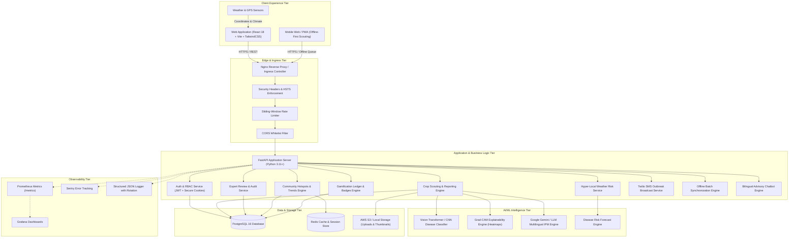
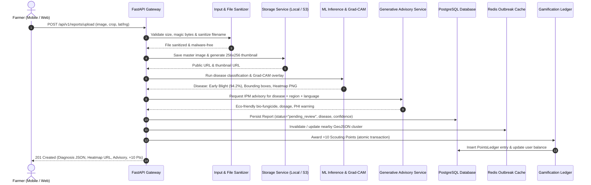
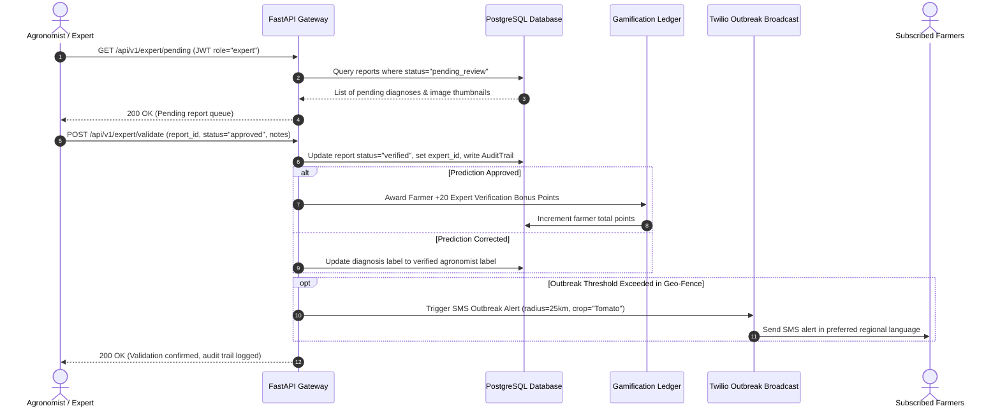
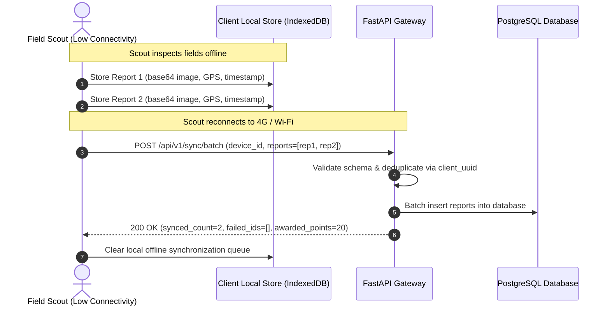

# CropHealthAI System Architecture & Data Flow

CropHealthAI (`god_thinks`) is an enterprise-grade, edge-ready agricultural intelligence platform engineered to detect crop diseases, provide multilingual integrated pest management (IPM) advisories, empower agronomists through expert-in-the-loop validation, and foster community surveillance through gamified outbreak reporting.

---

## 1. High-Level System Architecture

The CropHealthAI architecture is decoupled into five distinct tiers: **Client Experience Tier**, **API Gateway & Routing Tier**, **Application & Security Tier**, **AI/ML & GenAI Intelligence Tier**, and **Data & Cloud Storage Tier**.



---

## 2. Core Components & Tier Responsibilities

### 2.1 Client Experience Tier
- **Frontend Single Page Application (SPA)**: Built with **React 18**, **TypeScript**, **Vite**, and **TailwindCSS**. Delivers sub-second responsiveness with component-level state isolation:
  - **Upload & Disease Diagnosis**: Live image camera capture, pre-flight file size check, and diagnostic progress animation.
  - **Explainability View**: Side-by-side comparison of original leaf vs. Grad-CAM visual cues with high-attention bounding boxes.
  - **Multilingual Advisory**: Dynamically translated actionable treatments (English, Hindi, Telugu, Marathi, Spanish, etc.).
  - **Community Map & Outbreaks**: Interactive Leaflet / Mapbox map visualizing GeoJSON outbreak clusters.
  - **Expert Portal**: Agronomist dashboard for reviewing pending classifications with overlay toggles, audit history, and feedback.
  - **Gamification & Leaderboard**: Animated point badges, reward redemption catalog, and regional leaderboard.
  - **Settings & SMS Alerts**: Farmer opt-in toggle, geo-fence radius slider, and language selector.

### 2.2 Ingress & Security Tier
- **Nginx Ingress**: Reverse proxy providing TLS termination, SSL session caching, and static asset delivery.
- **Defensive HTTP Headers**:
  - `Strict-Transport-Security: max-age=31536000; includeSubDomains; preload`
  - `X-Content-Type-Options: nosniff`
  - `X-Frame-Options: DENY`
  - `X-XSS-Protection: 1; mode=block`
  - `Referrer-Policy: strict-origin-when-cross-origin`
  - `Permissions-Policy: camera=(), microphone=(), geolocation=(self)`
- **Sliding-Window Rate Limiting**: Token-bucket sliding window tracking client IPs (120 requests/minute API-wide; 20 requests/minute for image uploads).
- **CORS Whitelist**: Strict origin validation restricting access to designated client domains.
- **Brute-Force Protection**: 5 failed login attempts trigger an automatic 5-minute lockout per client IP.

### 2.3 Application & Business Logic Tier
- **FastAPI Core**: Asynchronous Python ASGI microframework with type-safe Pydantic request/response schemas.
- **Authentication & RBAC**:
  - Stateless JWT token pairs (access token + refresh token).
  - Secure `HttpOnly`, `SameSite=Lax`, `Secure` cookies for refresh tokens to eliminate JavaScript XSS attack vectors.
  - Role-based authorization decorator (`@require_role("expert")` / `@require_role("admin")`).
- **Input Sanitization**: NFKC unicode normalization, null-byte stripping, script tag removal, and directory traversal (`../`) elimination.
- **Malware & File Integrity Guard**:
  - Header magic byte validation rejecting PE executables (`MZ`), ELF, Java class bytecode, and shell scripts (`#!`).
  - Web shell and script signature inspection.
  - Decompression bomb protection (max image dimension 8000x8000 pixels).

### 2.4 AI/ML & Explainable Vision Tier
- **Vision Inference Pipeline**: Deep convolutional neural network (ResNet50 / MobileNetV3 / Vision Transformer) trained on agricultural disease datasets (38+ plant disease classes across Tomato, Potato, Corn, Apple, Rice, Wheat).
- **Grad-CAM (Gradient-Weighted Class Activation Mapping)**: Computes gradients of the target class score with respect to the final convolutional feature maps, producing heatmaps highlighting infected foliage lesions.
- **Generative Advisory Engine**: Integrated with Google Gemini Vision and IPM knowledge bases to produce eco-friendly, biological, and chemical treatment guidelines with Pre-Harvest Interval (PHI) compliance and banned chemical warnings.

### 2.5 Data & Cloud Storage Tier
- **PostgreSQL 16**: Relational storage for users, crop reports, expert review audit trails, reward ledgers, and subscriptions with spatial indexing.
- **Redis 7**: High-performance caching for GeoJSON community outbreak clusters, weather risk forecasts, and session throttling.
- **Object Storage**: S3-compatible cloud storage (AWS S3, MinIO, or local file store) with automatic LANCZOS thumbnail generation (256x256) and web-optimized images (1600x1600).

### 2.6 Observability Tier
- **Prometheus Metrics**: Exposes `/metrics` endpoint with HTTP request counters, request latency histograms, active connections, and database health gauges.
- **Sentry Integration**: Real-time error logging and distributed performance tracing for backend and frontend.
- **Structured JSON Logging**: Centralized machine-readable log records with automated rotating file handlers (10MB per file, 5 backup generations).
- **Kubernetes Probes**: Native `/health` (liveness) and `/ready` (readiness) probes verifying database connections and storage availability.

---

## 3. End-to-End Data Flow Workflows

### 3.1 Farmer Scouting & Disease Diagnosis Flow



---

### 3.2 Expert Review & Validation Workflow



---

### 3.3 Offline Field Scouting & Batch Synchronization Flow



---

## 4. Technology Stack Matrix

| Layer | Component | Technology | Version | Purpose |
| :--- | :--- | :--- | :--- | :--- |
| **Frontend** | Framework | React | 18.2 | Component-driven user interface |
| **Frontend** | Language | TypeScript | 5.3 | Static typing and runtime safety |
| **Frontend** | Build Tool | Vite | 5.1 | Instant hot-reloading & optimized bundling |
| **Frontend** | Styling | TailwindCSS | 3.4 | Modern utility-first responsive styling |
| **Frontend** | Mapping | Leaflet / React-Leaflet | 1.9 | Outbreak cluster visualization |
| **Backend** | Framework | FastAPI | 0.110+ | High-performance asynchronous REST API |
| **Backend** | Server | Uvicorn / Gunicorn | 0.28+ | ASGI production server |
| **Backend** | Language | Python | 3.11+ | Business logic, async coroutines |
| **Database** | RDBMS | PostgreSQL | 16 | ACID relational storage |
| **Database** | ORM | SQLAlchemy | 2.0+ | Database modeling and query optimization |
| **Database** | Migrations | Alembic | 1.13+ | Schema migrations |
| **Caching** | In-Memory Store | Redis | 7.2 | GeoJSON caching, session rate limits |
| **Object Store** | Storage | AWS S3 / MinIO | S3 API | Scalable cloud file & image hosting |
| **Computer Vision**| Machine Learning | PyTorch / TensorFlow | 2.15+ | Disease classification & Grad-CAM |
| **Generative AI**| Advisory LLM | Google Gemini 1.5 | API | Multilingual IPM treatment generator |
| **Observability**| Metrics | Prometheus Client | 0.20+ | System & HTTP metric telemetry |
| **Observability**| Error Tracking | Sentry SDK | 1.40+ | Distributed tracing and error catching |
| **Observability**| Logging | Python Logging | 3.11+ | Rotating structured JSON logging |
| **DevOps** | Containerization | Docker & Docker Compose | 25+ | Container packaging & local dev |
| **DevOps** | Orchestration | Kubernetes (K8s) | 1.28+ | Production container orchestration |
| **CI/CD** | Automation | GitHub Actions | v4 | Automated testing, linting & Docker builds |

---

## 5. Security & Reliability Architecture

```
+---------------------------------------------------------------+
|                      Client Request                           |
+---------------------------------------------------------------+
                               |
                               v
+---------------------------------------------------------------+
| 1. Transport Security: TLS 1.3 & HTTPS 301 Redirect           |
|    Strict-Transport-Security: max-age=31536000 (HSTS)         |
+---------------------------------------------------------------+
                               |
                               v
+---------------------------------------------------------------+
| 2. Defense Headers: X-Content-Type-Options, X-Frame-Options,  |
|    X-XSS-Protection, Referrer-Policy, Permissions-Policy      |
+---------------------------------------------------------------+
                               |
                               v
+---------------------------------------------------------------+
| 3. Rate Limiting: Sliding-Window Bucket (120 req/min general, |
|    20 req/min uploads, 5 failed attempts/5min login lockout)  |
+---------------------------------------------------------------+
                               |
                               v
+---------------------------------------------------------------+
| 4. Input & File Sanitization:                                 |
|    - NFKC Unicode normalization & null-byte stripping         |
|    - HTML/JS tag stripping & entity encoding                  |
|    - Path traversal removal (../)                             |
|    - Executable magic byte scan (MZ, ELF, Mach-O, scripts)    |
|    - Decompression bomb check (Max 8000x8000)                 |
+---------------------------------------------------------------+
                               |
                               v
+---------------------------------------------------------------+
| 5. Authentication & Authorization:                            |
|    - JWT Bearer verification                                  |
|    - HttpOnly, SameSite=Lax, Secure Refresh Token Cookies     |
|    - Strict RBAC: Farmer vs. Agronomist Expert                |
+---------------------------------------------------------------+
```

1. **Defense-in-Depth**: Every input layer independently validates schemas, content types, and binary magic numbers.
2. **Resilience & High Availability**: Stateless API pods allow horizontal autoscaling (HPA) in Kubernetes from 2 to 20 replicas based on CPU/memory metrics.
3. **Database Fault Tolerance**: Database connection pool with automatic recycling, connection timeout handling, and transactional rollback on failure.
