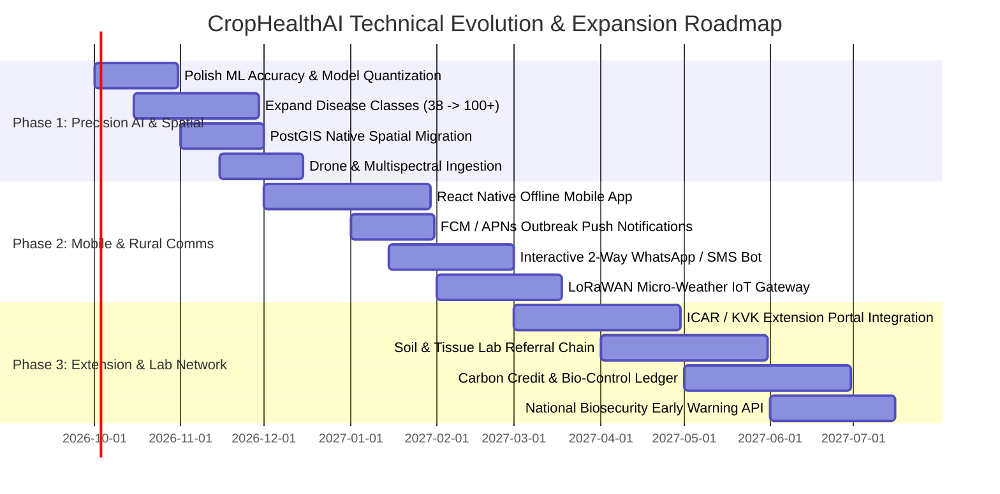

# CropHealthAI Product & Technical Roadmap 🚀

This document outlines the strategic product vision, phased engineering milestones, technical architecture evolution, and estimated effort for **CropHealthAI (`god_thinks`)**.

---

## 📅 Roadmap Overview at a Glance

---

## Phase 1: Precision AI, PostGIS & Diagnostic Expansion
**Timeline: Months 1–3 | Total Estimated Effort: ~6 Person-Months**

### 1.1 Polish ML Accuracy & Edge Quantization
- **Goal**: Elevate Top-1 model accuracy from ~94% to **>97.5%** while reducing inference latency to **<40ms**.
- **Tasks**:
  - Implement Vision Transformer (ViT-Small / Swin-T) fine-tuned on self-supervised agricultural imagery (MAE/DINOv2).
  - Train multi-task heads for simultaneous:
    1. Disease classification.
    2. Severity score estimation (0% - 100% defoliation index).
    3. Foliage quality / blur / out-of-focus detection.
  - Export models to **ONNX Runtime** and **TensorFlow Lite (TFLite)** with post-training INT8 quantization for sub-20MB mobile edge execution.
- **Estimated Effort**: 6 person-weeks.

### 1.2 Expand Disease Coverage (38 to 100+ Classes)
- **Goal**: Expand from current staples (Tomato, Potato, Corn, Apple, Rice, Wheat) to vulnerable arid and tropical smallholder crops.
- **Tasks**:
  - Add Cassava (Mosaic Disease, Brown Streak Disease), Sorghum, Pearl Millet, Chickpea, Pigeonpea, Sugarcane, Cotton, and Coffee.
  - Curate localized lesion variations across diverse climate zones (East Africa, Indo-Gangetic Plains, Latin America).
  - Benchmark against field-condition datasets containing heavy background soil, dust, and solar glare.
- **Estimated Effort**: 8 person-weeks.

### 1.3 PostGIS Native Spatial Database Integration
- **Goal**: Replace standard latitude/longitude float columns with PostgreSQL **PostGIS** spatial geometries.
- **Tasks**:
  - Add PostGIS extension (`CREATE EXTENSION postgis;`) in SQLAlchemy models (`geometry(Point, 4326)`).
  - Migrate proximity lookups to hardware-accelerated R-Tree spatial indexes (`GIST`).
  - Implement spatial buffering (`ST_DWithin`) and arbitrary polygon farm boundary tracing (`ST_Contains`).
  - Enable vector tile serving (MVT / Mapbox Vector Tiles) for sub-second rendering of millions of outbreak incidents on frontend maps.
- **Estimated Effort**: 4 person-weeks.

### 1.4 Drone & Multi-Spectral Imagery Ingestion
- **Goal**: Allow aerial drone orthomosaics and multispectral NDVI geotiffs to be processed in field-scale batches.
- **Tasks**:
  - Chunk high-resolution GeoTIFF files into 512x512 inference tiles with spatial georeferencing.
  - Calculate Normalized Difference Vegetation Index (NDVI) and Chlorophyll Absorption Ratio Index (CARI).
  - Stitch disease heatmaps back to farm boundary GeoJSON.
- **Estimated Effort**: 6 person-weeks.

---

## Phase 2: Mobile Ecosystem & Rural Connectivity Workflows
**Timeline: Months 4–6 | Total Estimated Effort: ~8 Person-Months**

### 2.1 Offline-First Native Mobile App (React Native / Flutter)
- **Goal**: Deliver a standalone native Android and iOS mobile app operating 100% offline in remote field conditions.
- **Tasks**:
  - Embedded local SQLite database using WatermelonDB / SQLite with background synchronization workers.
  - On-device TFLite inference: instant leaf diagnosis without network connection.
  - Camera guidance overlay ensuring proper focus, distance, and lighting before capture.
  - Queued background synchronization with opportunistic upload upon detecting 2G/3G/4G or Wi-Fi.
- **Estimated Effort**: 10 person-weeks.

### 2.2 Push Notifications & Proactive Micro-Alerts
- **Goal**: Real-time push alerts notifying farmers when an outbreak is verified within their personal geo-fence perimeter.
- **Tasks**:
  - Integrate **Firebase Cloud Messaging (FCM)** for Android and **Apple Push Notification Service (APNs)** for iOS.
  - Topic-based messaging grouped by crop and S2/H3 spatial geohashes.
  - Rich notification payloads with thumbnail previews and one-tap IPM advice access.
- **Estimated Effort**: 4 person-weeks.

### 2.3 Interactive Farmer SMS & WhatsApp Workflows
- **Goal**: Enable zero-smart-device accessibility for farmers with basic feature phones.
- **Tasks**:
  - **WhatsApp Business API Bot**: Farmers send leaf photos over WhatsApp; CropHealthAI automatically responds with diagnostic results, Grad-CAM heatmap, and audio voice notes in their regional language.
  - **Interactive 2-Way SMS (Twilio / Gupshup)**: Text-based decision tree ("Reply 1 for bio-remedies, 2 for nearest agronomist").
  - **USSD Menu Support**: Interactive voice and dial-in query system (`*99#` style) for field advisory access.
- **Estimated Effort**: 8 person-weeks.

### 2.4 LoRaWAN Micro-Weather IoT Station Gateway
- **Goal**: Connect hyper-local soil moisture, temperature, and leaf-wetness sensors directly into the CropHealthAI risk model.
- **Tasks**:
  - Ingestion gateway supporting MQTT / The Things Network (TTN) for low-cost ($25) solar field sensors.
  - Automated disease risk triggers: alert farmers when leaf wetness exceeds 8 consecutive hours under temperatures between 18°C and 25°C.
- **Estimated Effort**: 6 person-weeks.

---

## Phase 3: Agronomy Extension Services & Lab Referral Network
**Timeline: Months 7–12 | Total Estimated Effort: ~12 Person-Months**

### 3.1 National Extension Services & University Portals
- **Goal**: Integrate with national agronomy agencies (ICAR Krishi Vigyan Kendras [KVK], USDA Extension, CGIAR / FAO).
- **Tasks**:
  - Dedicated Agronomist Extension Dashboard: district-level outbreak triage, field worker route optimization, and mass farmer advisories.
  - Automated regulatory chemical restriction updates synced directly with government biosecurity registries.
  - Federated Learning framework allowing universities to train disease models without transferring proprietary farmer imagery off-premises.
- **Estimated Effort**: 12 person-weeks.

### 3.2 Physical Soil & Pathology Lab Referral Workflows
- **Goal**: Close the loop when AI detects anomalies requiring laboratory validation (e.g. viral wilt or novel bacterial strains).
- **Tasks**:
  - Automated Chain-of-Custody sample kit generation with printable QR barcodes.
  - Courier logistics integration (sample pickup scheduling directly from the farm).
  - Laboratory Information Management System (LIMS) REST API for ingestion of lab PCR and soil spectroscopy results back into the farmer's dossier.
- **Estimated Effort**: 8 person-weeks.

### 3.3 Carbon Credits & Eco-Friendly Regenerative Ledger
- **Goal**: Monetize farmer adoption of biological pest controls over chemical pesticides.
- **Tasks**:
  - Verified reduction in synthetic chemical applications tracked in an immutable, auditable ledger.
  - Partner with certified carbon & biodiversity credit registries (e.g. Verra, Gold Standard) to distribute financial rewards to farmers.
  - Redeem points directly for certified organic inputs, micro-irrigation gear, or direct bank transfer (DBT).
- **Estimated Effort**: 10 person-weeks.

### 3.4 National Biosecurity Outbreak Early Warning API
- **Goal**: Provide government ministries with epidemic modeling and quarantine perimeter suggestions.
- **Tasks**:
  - SEIR (Susceptible-Exposed-Infectious-Recovered) epidemiological spread simulation combining wind vectors and rainfall.
  - Automated export of surveillance reports to standard international biosecurity formats (FAO / IPPC).
- **Estimated Effort**: 8 person-weeks.

---

## 📊 Summary of Effort & Priority Matrix

| Phase | Milestone | Priority | Effort (Weeks) | Key Dependencies | Primary Business Metric |
| :--- | :--- | :--- | :--- | :--- | :--- |
| **P1** | ML Accuracy & ViT Quantization | Critical | 6 | Clean annotated datasets | Top-1 Accuracy >97.5% |
| **P1** | 100+ Disease Classes | High | 8 | Image collection partner | Geographic coverage |
| **P1** | PostGIS Spatial Migration | Critical | 4 | PostgreSQL 16 PostGIS | Spatial query latency <15ms |
| **P1** | Drone / Orthomosaic Ingestion | Medium | 6 | GDAL / Rasterio | Farm-scale mapping |
| **P2** | React Native Offline Mobile App| Critical | 10 | On-device TFLite | Offline scouting retention |
| **P2** | Outbreak Push Notifications | High | 4 | FCM / APNs credentials | User re-engagement +40% |
| **P2** | WhatsApp & 2-Way SMS Bot | Critical | 8 | Twilio / Meta API | Non-smartphone access |
| **P2** | LoRaWAN IoT Micro-Stations | Medium | 6 | MQTT / Hardware partner | Risk prediction precision |
| **P3** | Government Extension Portal | High | 12 | Institutional MoUs | Agronomist verification throughput |
| **P3** | Lab Sample Referral Chain | Medium | 8 | Pathology lab partners | Diagnostic fidelity |
| **P3** | Regenerative Carbon Ledger | Medium | 10 | Registry certification | Farmer income uplift ($/acre) |
| **P3** | Biosecurity Outbreak Simulator | High | 8 | Meteorological models | Epidemic containment speed |
